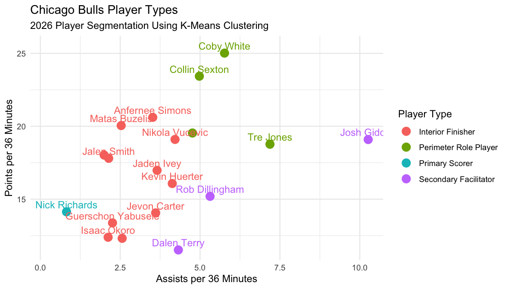
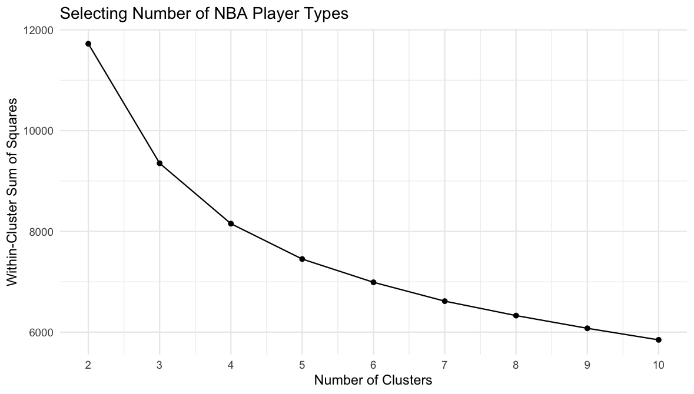

# NBA Performance and Player Segmentation

An NBA analytics project using Four Factors, logistic regression, and k-means clustering to evaluate team performance and identify player types.

## Project Overview

This project examines NBA performance from both a team and player perspective. The first portion uses Dean Oliver's Four Factors to evaluate team performance and build a model estimating win probability. The second portion uses unsupervised machine learning to group NBA players into statistical player types.

The Chicago Bulls are used as the primary example to show how these methods can be applied to evaluate both overall team performance and roster construction.

## Data

NBA team and player box score data is pulled directly into R using the `hoopR` package.

Team data from the 2021 through 2025 seasons is used to build the Four Factors win model, while player data from 2021 through 2026 is used for player segmentation.

Players with fewer than 500 minutes in a season are excluded from the clustering analysis to reduce the impact of small samples.

## Four Factors Analysis

Team performance is evaluated using four factors:

- Effective field goal percentage (eFG%)
- Turnover percentage (TOV%)
- Offensive rebound percentage (OREB%)
- Free throw attempt rate (FTA Rate)

League rankings are calculated for each factor, allowing the Chicago Bulls to be compared with the rest of the NBA.

## Win Probability Model

A logistic regression model is built using game-level data from the 2021 through 2025 NBA seasons.

The model estimates the probability of winning based on:

- Effective field goal percentage
- Offensive rebound percentage
- Turnover percentage
- Free throw attempt rate

The model is then applied to Chicago Bulls games to compare the team's actual win total with its expected win total based on its Four Factors performance.

## Player Segmentation

NBA players are grouped using k-means clustering based on seven standardized statistical features:

- Effective field goal percentage
- Three-point attempt rate
- Free throw attempt rate
- Turnover rate
- Offensive rebounds per 36 minutes
- Assists per 36 minutes
- Points per 36 minutes

The elbow method is used to evaluate the number of clusters before creating four player groups.

## Player Types

The resulting clusters are interpreted as four general player archetypes:

- Primary Scorer
- Interior Finisher
- Perimeter Role Player
- Secondary Facilitator

These classifications are then applied to the Chicago Bulls roster to visualize the different offensive roles represented on the team.

## Tools Used

- R
- tidyverse
- hoopR
- ggplot2
- Logistic regression
- K-means clustering
- Feature engineering
- Data visualization

## Files

- `nba_analysis.R` — Data collection, Four Factors analysis, logistic regression, player clustering, and visualization
- `bulls-player-types.png` — Visualization of Chicago Bulls player archetypes
- `elbow-plot.png` — Elbow method used to evaluate the number of player clusters
